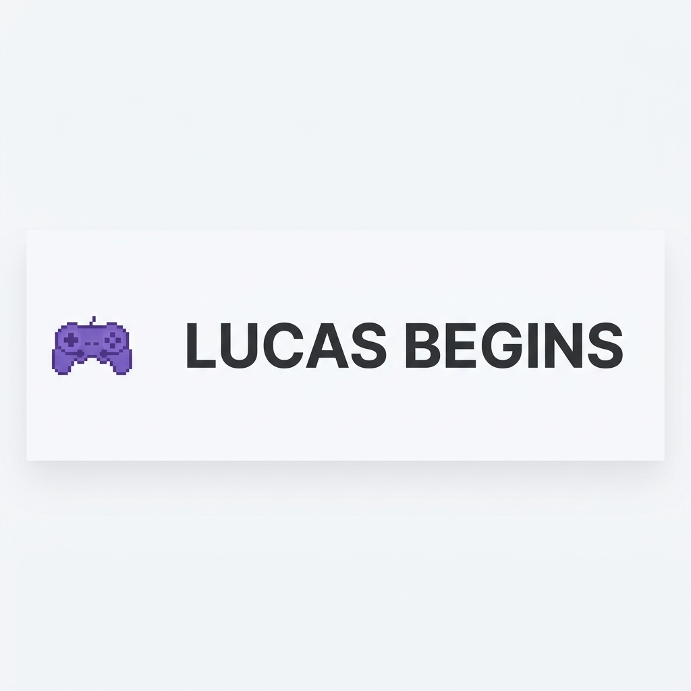

# 🕹️ Lucas Begins - Retro Gaming Journal



> **"A essência dos 16-bits em uma experiência web de alta fidelidade."**

O **Lucas Begins** é um jornal digital de luxo dedicado à cultura retro gaming. Inspirado na estética nítida dos consoles clássicos e na sofisticação das interfaces modernas, o projeto oferece uma jornada imersiva através de análises, notícias e memórias da era dourada dos videogames.

---

## 📘 Documentação do Projeto

Para facilitar a gestão e o desenvolvimento, dividimos as informações em guias especializados:

-   **[🔧 Guia de Manutenção](./MAINTENANCE.md)**: Como postar, gerir categorias e adicionar administradores.
-   **[⚙️ Documentação Técnica](./DOCUMENTATION.md)**: Detalhes sobre arquitetura, hooks, componentes e banco de dados.

---

## ✨ Destaques do Projeto

### 🎨 Design "Modern Arcade"
Uma evolução da estética do SNES Americano. Fundo perolado limpo, roxos elétricos e **sombras pretas sólidas** que dão profundidade e peso visual à interface.

### 📝 CMS Imersivo
Editor de Markdown integrado com sistema de rascunhos automático (`LocalStorage`) para garantir que nenhum conteúdo seja perdido durante a criação.

### 🔐 Segurança Pro
Sistema de autenticação via Google e proteção de rotas administrativas com verificação de papéis (Admin/User) direto no Firestore.

---

## 🛠️ Tecnologias de Ponta

-   **React 19** + **Vite**
-   **Firebase** (Auth & Firestore Database)
-   **Tailwind CSS** + **Neo-Retro Design System**
-   **React Router 7**
-   **Lucide Icons**

---

## 🚀 Como Executar

1.  **Clone e Instale:**
    ```bash
    git clone https://github.com/lucasdpv/lucas-begins.git
    cd lucas-begins
    npm install
    ```

2.  **Variáveis de Ambiente:**
    Crie um arquivo `.env` na raiz com suas credenciais do Firebase:
    ```env
    VITE_FIREBASE_API_KEY=...
    VITE_FIREBASE_AUTH_DOMAIN=...
    VITE_FIREBASE_PROJECT_ID=...
    ```

3.  **Inicie o Motor:**
    ```bash
    npm run dev
    ```

---

**Desenvolvido com 💜 por Lucas Vieira.**
*"Insert Coin to Continue"*
