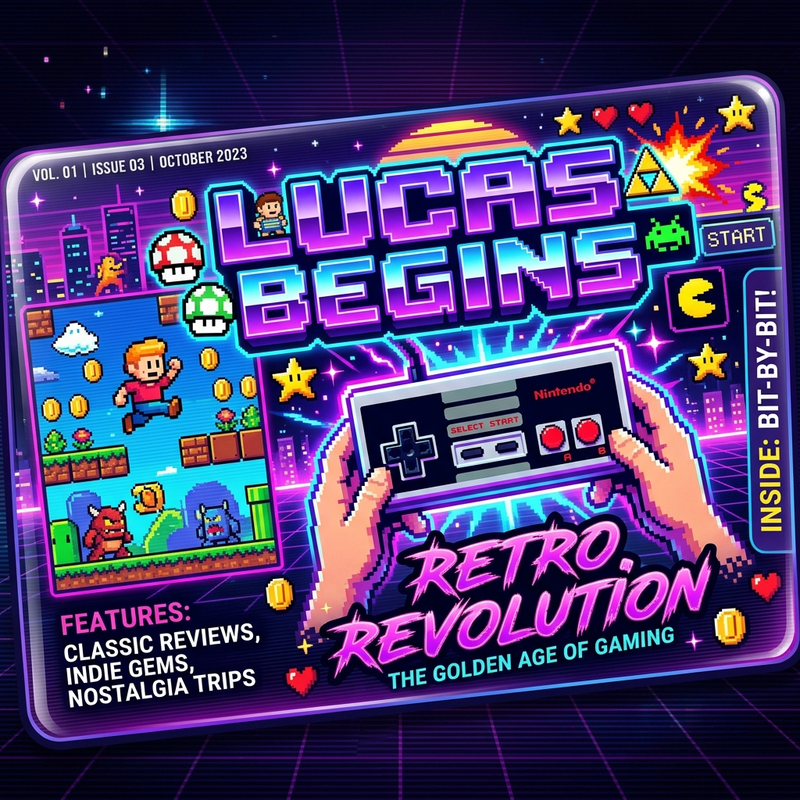

# 🕹️ Lucas Begins - Retro Gaming Journal



> **"Uma jornada nostálgica pela era de ouro dos videogames, direto no seu navegador."**

O **Lucas Begins** não é apenas um blog, é uma cápsula do tempo digital inspirada nas clássicas revistas de videogame dos anos 90 como Ação Games e Super GamePower. Desenvolvido com uma estética *retro-moderna*, o projeto combina a nostalgia do pixel art com as tecnologias mais robustas do desenvolvimento web atual.

---

## 🚀 Tecnologias Utilizadas

Este projeto foi construído utilizando o estado da arte do ecossistema React:

-   **React 19**: Performance e hooks modernos.
-   **Vite**: Build system ultra-rápido.
-   **Tailwind CSS**: Estilização dinâmica e responsiva.
-   **React Router 7**: Gerenciamento de rotas e navegação fluída.
-   **Context API**: Gerenciamento de estado global centralizado (Auth, Temas, Posts).
-   **Lucide React**: Biblioteca de ícones minimalistas.
-   **React Helmet Async**: Otimização de SEO dinâmico por página.
-   **UIW React MD Editor**: Editor de Markdown imersivo para criação de conteúdo.

---

## ✨ Funcionalidades Principais

### 🎨 Estética Retro Gaming
Layout inspirado em scans de revistas antigas, com efeitos de "scanline", paletas de cores vibrantes e tipografia Chakra Petch para aquele feeling de fliperama.

### 📝 Painel de Editor (CMS Interno)
Um sistema administrativo completo para gerenciar o conteúdo:
-   Criar, editar e excluir artigos.
-   Editor de Markdown com preview em tempo real.
-   Upload e gerenciamento de imagens e categorias.

### 📱 Experiência do Usuário (UX)
-   **Tema Dark/Light**: Escolha seu modo de jogo.
-   **Responsividade Total**: Deixe sua leitura confortável no PC ou no Celular.
-   **Scroll Restoration**: Nunca perca o foco ao navegar pelos artigos.
-   **Skeletons de Loading**: Feedback visual polido enquanto os dados são processados.

### 🔍 SEO & Desempenho
-   Metadados dinâmicos para melhor indexação e compartilhamento em redes sociais.
-   Componentização modular para garantir manutenibilidade e performance.

---

## 🛠️ Como Executar o Projeto

Para rodar o **Lucas Begins** localmente, siga estes passos:

1.  **Clone o repositório:**
    ```bash
    git clone https://github.com/lucasdpv/lucas-begins.git
    ```

2.  **Entre na pasta do projeto:**
    ```bash
    cd lucas-begins
    ```

3.  **Instale as dependências:**
    ```bash
    npm install
    ```

4.  **Inicie o servidor de desenvolvimento:**
    ```bash
    npm run dev
    ```

5.  **Acesse no seu navegador:**
    `http://localhost:5173`

---

## 🗺️ Roadmap de Evolução

- [x] Refatoração de Arquitetura (Modularização).
- [x] Implementação de Context API e React Router.
- [x] Integração de Editor de Markdown.
- [/] Integração com **Firebase** (Auth & Firestore).
- [ ] Deploy Automático via Vercel.

---

## 🤝 Contribuições

Sinta-se à vontade para abrir uma *Issue* ou enviar um *Pull Request*. Feedbacks são sempre bem-vindos para tornar essa jornada retro ainda mais épica!

**Desenvolvido com 💜 por Lucas Vieira.**
